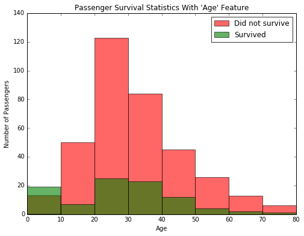
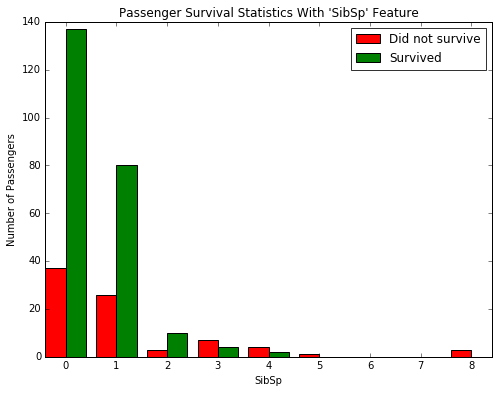

# Machine Learning Project : Titanic Survival Exploration 
This project contains create decision functions that attempt to predict survival outcomes from the 1912 Titanic disaster based on each passenger’s features, such as sex, age, sibsp, embarrked and cabin class which accurately predict the outcomes for at least 80% of the passengers in the provided data.

[View features of dataset on Kaggle](https://www.kaggle.com/c/titanic/data)

**Software and Libraries**

This project uses the following software and Python libraries:

- Python 2.7
- NumPy
- pandas
- matplotlib
- iPython Notebook

**Introduction**:

In 1912, the ship RMS Titanic struck an iceberg on its maiden voyage and sank, resulting in the deaths of most of its passengers and crew. This project explores a subset of the RMS Titanic passenger manifest to determine which features best predict whether someone survived or did not survive.

From a sample of the RMS Titanic data, we can see the various features present for each passenger on the ship:
- **Survived**: Outcome of survival (0 = No; 1 = Yes)
- **Pclass**: Socio-economic class (1 = Upper class; 2 = Middle class; 3 = Lower class)
- **Name**: Name of passenger
- **Sex**: Sex of the passenger
- **Age**: Age of the passenger (Some entries contain `NaN`)
- **SibSp**: Number of siblings and spouses of the passenger aboard
- **Parch**: Number of parents and children of the passenger aboard
- **Ticket**: Ticket number of the passenger
- **Fare**: Fare paid by the passenger
- **Cabin** Cabin number of the passenger (Some entries contain `NaN`)
- **Embarked**: Port of embarkation of the passenger (C = Cherbourg; Q = Queenstown; S = Southampton)

Since we're interested in the outcome of survival for each passenger or crew member, we can remove the **Survived** feature from this dataset and store it as its own separate variable `outcomes`. We will use these outcomes as our prediction targets. 

**Decision Functions**
- Check for the sex of survived passengers
```python
survival_stats(data, outcomes, 'Sex')
```

- Check for the age of survived passengers
```python
survival_stats(data, outcomes, 'Age', ["Sex == 'male'"])
```

- Building a more complex decision tree using multiple filter conditions
```python
survival_stats(data, outcomes, 'SibSp', ["Sex == 'female'" or "Age <15 " and "Pclass=3" and "Embarked != 'S' "])
```


**Accuracy**
```python
print accuracy_score(outcomes, predictions)
```
Predictions have an accuracy of **82.49%**
